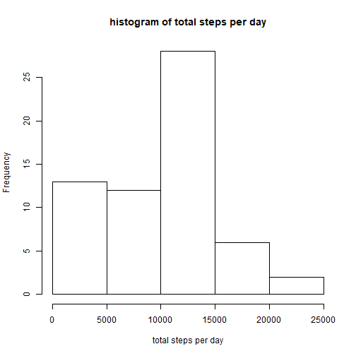
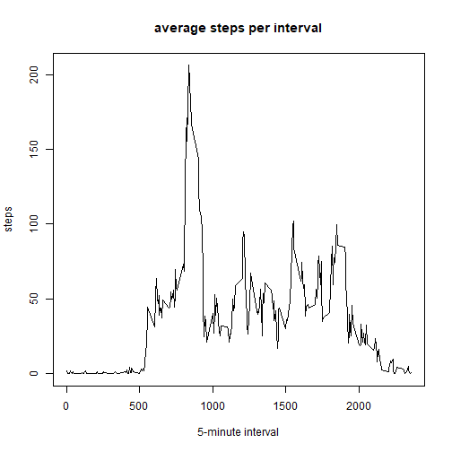
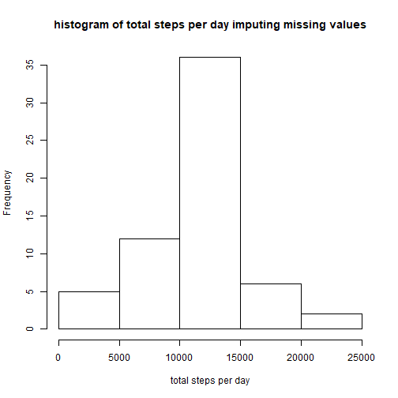
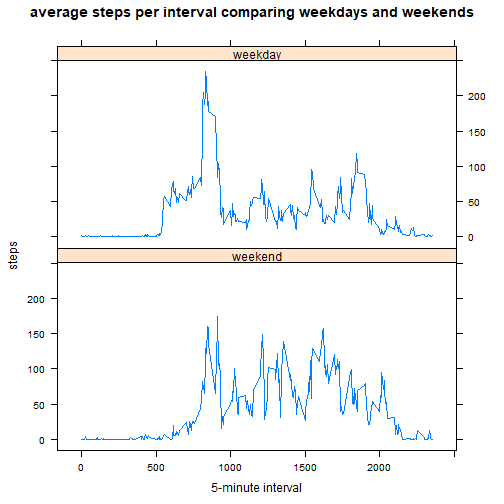

## Loading and preprocessing the data

```r
df <- read.csv("activity.csv", stringsAsFactors = FALSE)
df <- transform(df, date = as.Date(df$date, "%Y-%m-%d"))
```


## What is mean total number of steps taken per day?

```r
stepsperday <- aggregate(df$steps, list(df$date), sum, na.rm = TRUE)
hist(stepsperday$x, xlab = "total steps per day", main = "histogram of total steps per day")
```



* The mean total steps per day is: 9354.23
* The median total steps per day is: 10395

## What is the average daily activity pattern?

```r
stepsperinterval <- aggregate(df$steps, list(df$interval), mean, na.rm = TRUE)
plot(stepsperinterval$Group.1, stepsperinterval$x, type = "l",
     xlab = "5-minute interval", ylab = "steps", main = "average steps per interval")
```



* The 5 minute interval with the maximum steps on average is:
835

## Imputing missing values - using the average for that time interval 
* The number of missing values in the data set is: 2304


```r
impdf <- data.frame(NA, NA)
impdf <- cbind(impdf, df)
for (i in 1:nrow(df)) {
     if (is.na(df[i, "steps"])) impdf[i, "steps"] <- subset(stepsperinterval, Group.1 == df[i, "interval"])[, "x"]
}

impstepsperday <- aggregate(impdf$steps, list(impdf$date), sum)
hist(impstepsperday$x, xlab = "total steps per day", main = "histogram of total steps per day imputing missing values")
```



* The mean total steps per day imputing missing values is: 10766.2
* The median total steps per day imputing missing values is: 10766.2
* Impact of imputing missing values on mean:
Increased
* Impact of imputing missing values on median:
Increased

## Are there differences in activity patterns between weekdays and weekends?

```r
library(lattice)
df$daytype <- factor(
                weekdays(df$date),
                labels = c("weekend", "weekday", "weekday", "weekday", "weekday", "weekday", "weekend"),
                levels = c("Sunday", "Monday", "Tuesday", "Wednesday", "Thursday", "Friday", "Saturday")
            )
stepsperintervalbydaytype <- aggregate(df$steps, list(df$interval, df$daytype), mean, na.rm = TRUE)
xyplot(x ~ Group.1 | Group.2, data = stepsperintervalbydaytype, layout = c(1, 2), type = "l",
       xlab = "5-minute interval", ylab = "steps", main = "average steps per interval comparing weekdays and weekends")
```


